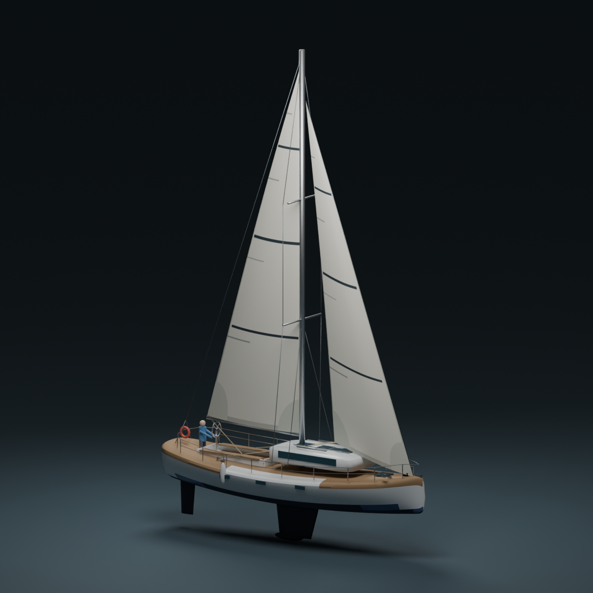

# Blender sailing model and physics review, 2026-09-08

## Result

The editable scene is `assets/3d/regatta_sloop_sailing.blend`, built and rendered
with Blender 5.1.1. The game asset is `public/models/regatta_sloop_sailing.glb`;
`YACHT_MODEL_URL` now selects it in the shared web/iOS WebView scene.
Published to the website on 2026-09-08. iOS 1.6.1 (40) is available to TestFlight Self and submitted to App Review, WAITING_FOR_REVIEW with automatic release after approval. This is not yet a public App Store release.

This is a real Blender scene and Cycles render, not an AI-generated concept.
Work was performed through Blender's Python API. The desktop application was
also launched; the saved model was inspected through its rendered outputs.



The presentation floor is a studio stage, not the waterline. It deliberately
shows the keel and rudder. Cameras and lights are excluded from the game GLB.

## Physics reviewed

- Apparent wind is the incoming air velocity minus boat velocity, including
  leeway. Lift acts across apparent flow; drag acts along it. The implementation
  uses dynamic pressure `0.5 * rho * AWS^2`, sail area and coefficient curves.
- The force model and visual sail share the height-dependent twist function.
  Five weighted sections approximate a triangular sail. This is not a wind
  gradient model or CFD; the same apparent wind is currently used at all heights.
- Main/jib flat planform areas remain 45/30 m2. Perspective and sheet angle
  change their apparent screen sizes. Inflated surface area is not flat area.
- Signed heeling moments are balanced against the simplified GM righting model.
  Leeway, quadratic hull drag and a hull-speed cap remain approximations.
- Found and fixed: roller furling reduced both jib area AND its pressure height
  using the slab-reef rule. The drawn and sectioned jib remains full-height on
  the forestay. Its reference pressure height now stays fixed while area reduces.
  At half furl, the isolated jib's force and heeling moment now both halve under
  identical wind and initial state. At full furl both are zero.
- The fixed jib pressure height is still a simplifying assumption, not a claim
  that real pressure distribution never moves. Actual sail polars, stability
  curves and sea-trial data are needed before claiming a calibrated yacht.
- Corrected the contradictory sail-side API comment and the misleading Venturi
  explanation in the slot helper. Its bounded multiplier remains a gameplay
  approximation. No unmeasured lift/drag coefficients were invented for this update.

## Blender changes

1. Rebuilt the malformed standing rigging from explicit mast, spreader, deck
   and forestay attachment points. Previously its Blender bounds reached
   x=-11.6589 m and z=-2.6176 m, outside the hull and below water. New bounds are
   x=-6.1136..6.3132 m and z=1.4953..19.7048 m.
2. Replaced the skewed boom with a round spar aligned under the main foot.
3. Replaced both imported sails with samples of the runtime sail geometry.
   Each has five alternate shape keys: Flat, Full, TwistOpen, Luffing, Reduced.
   All weights start at zero; use one alternate at a time in Blender. Runtime
   continues to compute the live mesh, so a Blender-only pose is not mistaken
   for an interactive cloth solver.
4. Explicit draft maxima: main 45% and jib 38% of chord. These are chosen design
   values for this synthetic cruiser. Bounded depth range is 7-14% before the
   height envelope; the forward and trailing ends remain attached to the chord.
5. Embedded UV markings: three draft stripes, batten pockets, edge tapes and
   corner reinforcement. They follow the changing cloth, including the raised
   clew. Removed old rigid decorations that floated away during deformation.
6. Preserved the named MainRig, JibRig, MainSail, Jib and Rudder integration
   contract. Export contains 45 meshes and 23,292 triangles before runtime cloth
   substitution, not a measured count of the whole scene's GPU draw calls.

The suspected forestay-axis bug was disproved by numerical tests: the old
constant represented the same direction. The axis now comes directly from
SAIL_PLAN to remove duplication, not to claim a nonexistent physics fix.

## Sources and interpretation

- [North Sails, Understanding Twist](https://www.northsails.com/fr-fr/blogs/north-sails-blog/north-u-understanding-twist-by-bill-gladstone): upper apparent-wind angle and twist, adjustment for speed and conditions. Used as qualitative design guidance, not as a coefficient table.
- [North Sails, Interlake tuning guide](https://www.northsails.com/fr-ca/blogs/north-sails-blog/interlake-tuning-guide): draft position and luff tension. The guide concerns its own class; this model's 45%/38% choices are not presented as that class's measured sail specification.
- [Day, performance prediction for sailing dinghies](https://pureportal.strath.ac.uk/files-asset/64217569/Day_OE_2017_Performance_prediction_for_sailing_dinghies.pdf): limits of coefficient-based performance prediction and the coupling of headsail sheeting and twist. Relevant to limitations of our simplified section model, not certification of the synthetic cruiser.

The earlier Gentry URL currently redirects to an unrelated site. It was not
used as fresh evidence in this review.

## Reproduction

```sh
node scripts/blender/export_sail_shapes.mjs
/Applications/Blender.app/Contents/MacOS/Blender --background --python scripts/blender/build_sailing_yacht.py -- /absolute/path/to/regatta
npm run build:race-server
npm run test:physics
npx vitest run src/features/simulator-3d src/features/simulator-v3
```

The first command samples the shared TypeScript geometry into `sail-shapes.json`.
Blender imports those samples rather than maintaining a different Python sail
formula. Re-run both commands after geometry changes. The original GLB and
previous `.blend` remain available for comparison.

## Verification

- Blender export and three Cycles renders completed. Inspected side,
  three-quarter and stern views. A render caught all alternate shape keys being
  enabled together; defaults were corrected before final export. An asset test
  now guards against recurrence.
- 46 shared physics/race tests and 65 3D/Trainer tests passed, including three GLB contract tests.
- All 112 native mobile tests in 23 suites passed. Mobile TypeScript, ESLint, offline radio bundle and seven-language content checks passed.
- TypeScript and scoped ESLint passed.
- Production Next.js build passed. The first sandboxed attempt could not fetch
  Google Fonts; the network-enabled retry completed successfully.
- Browser: loaded the new GLB, examined sail view, sailing mode and free trim at
  85-degree main / 70-degree jib with 90% twist. No browser errors; the existing
  THREE.Clock deprecation warning remains. Backlit draft stripes are faint at
  the full-yacht camera distance and clearer in the Blender close view.
- No physical-device FPS/thermal test or real-yacht calibration is claimed.

## Anatomy and teaching interfaces

- Smoothed hull normals and improved gelcoat, teak and glass materials. Added cockpit slats, hatch frames, handrails, bow cleats, teaching sheets and fenders. Static teaching sheets/fenders are hidden in the sailing runtime, which keeps its dynamic sheets.
- Anatomy now loads the same GLB as the sailing scene. Removed the obsolete asset rotation and environment capture that caused a white canvas. Camera fitting uses visible morph positions; selecting a part focuses its area.
- All 17 teaching points are exported as named anchors and checked against shared web/mobile data. Updated descriptions in seven languages to match this synthetic yacht, including its single wheel. Dimensions no longer describe a different Bavaria model.
- Fixed desktop anatomy columns, sticky viewer and 44px part buttons. Historical anatomy posters remain separate illustrations; they were not rebuilt from Blender. Native offline anatomy retains its schematic view with updated descriptions.
- Basics: fixed wake particles drifting forward over the hull and made particle motion time-based. Slider arrow keys no longer also turn the boat; browser QA confirmed wind 180 to 181 degrees while heading stayed 90 degrees.
- Reviewed Trainer top, stern and side views. They remain deliberate educational projections. Further work should prioritize a larger sail inspection view, clearer wind and per-sail feedback, followed by short guided drills. A photorealistic replacement of every teaching diagram is not required for comprehension.

- iPhone QA caught duplicated course text overlapping the south wind label in Basics. Removed the duplicate canvas footer and drag hint; the accessible course and instructions remain in the adjacent panel.

## Published release verification

- Main model/content commit: `585acef`. Final web label fix: `43a7ca7`.
- Both deployments succeeded: [model deployment](https://github.com/Warlockus-prod/regatta/actions/runs/34203055331) and [final Basics fix](https://github.com/Warlockus-prod/regatta/actions/runs/34203987324). CI includes 46 physics, 14 3D, 51 Trainer, 131 radio, 60 API and 30 oral-grader tests, multiplayer lifecycle checks, nine pre-deploy E2E checks and 13 production E2E checks.
- Inspected production anatomy and sailing 3D. Basics heading and wind sliders remain independent; into-wind sets heading to the current wind bearing.
- Built, installed and launched exact iOS Release 1.6.1 (40) on the dedicated iPhone 17 Pro Simulator, iOS 26.5. Visually checked home, anatomy, Basics, Trainer top and the 3D sailing scene. Navigated home to anatomy and back, then across all three simulator entries. Screenshots: [anatomy](mobile/audits/blender-build40/anatomy.png), [3D boat](mobile/audits/blender-build40/boat3d.png), [Basics](mobile/audits/blender-build40/basics.png), [Trainer](mobile/audits/blender-build40/trainer-top.png), [home](mobile/audits/blender-build40/home.png).
- Xcode archive/export and Apple IPA validation/upload succeeded. Build `a27d56c2-6d5b-42bd-ba9c-c8121a113b72` is VALID and explicitly attached to TestFlight Self. Native build contains updated shared anatomy data and the previously verified offline radio course.
- Replaced build 39's pending review after build 40 was ready. Final review `68304705-1e26-4be2-99cc-04febed19aa6` entered WAITING_FOR_REVIEW on 2026-09-08 at 08:29 UTC. Release policy is AFTER_APPROVAL.
- Final Fastlane metadata precheck passed. An earlier run hit a transient privacy URL 502 during deployment; both canonical and legacy privacy URLs returned 200 afterward. Rechecked the final seven release-note localizations, five iPhone and five iPad screenshots (COMPLETE, other locales inherit the primary set), age declaration and non-exempt encryption=false.
- This verifies an iPhone Simulator release, not physical-device GPU performance, thermal behavior, or exhaustive tablet interaction. Offline native anatomy remains a schematic with synchronized teaching text; static historical posters are separate illustrations.

## Follow-up: wind-driven cloth and inspection cameras

The 3D sailing route now fills each sail independently using apparent air speed
and its signed incidence, including the shared five-section twist profile. A
bounded pressure response fills the cut shape; unloaded cloth sags between fixed
corners and luffs when air is present. Transitions are smoothed over about 0.24 s.
An over-eased sail is no longer classified from an absolute incidence as a full,
stalled sail with the wrong advice to ease farther. Downwind drag remains a
normal sailing state. Each sail has its own short feedback, with a distinct
head-to-wind instruction.

This is a visual approximation, not cloth stress simulation, CFD, or measured
yacht calibration. Depth, angle of attack and twist are separate trim factors;
a loaded sail can still be stalled. Stronger wind does not produce unlimited
belly. Qualitative references: [North Sails, Upwind Sail Power](https://www.northsails.com/en-nz/blogs/north-sails-blog/upwind-sail-power-by-bill-gladstone)
and [North Sails, Understanding Twist](https://www.northsails.com/fr-fr/blogs/north-sails-blog/north-u-understanding-twist-by-bill-gladstone).
The response constants and cut depths are choices for this synthetic boat. The
shared force engine and race balance are unchanged by this follow-up. Fully
backed sails, transient slot flow and spanwise wind shear need a richer coupled
model before they can be claimed as realistic.

- Added main/jib middle-section inspection presets and an astern preset. Camera
  resets account for the current heading, tack and the selected sail's sheet
  angle. Orbit remains manual after selecting a preset; it is not a tracking
  camera that locks to every subsequent helm/sheet movement.
- Replaced faint sea-level streaks with directed apparent-wind arrows at sail
  height. Their travel rate follows apparent speed. The toggle and readout name
  the same wind; the readout angle is relative to the bow. Arrows show incoming
  air, not a computed streamline solution around the sail.
- Normal cloth uses 925 vertices per sail, updated at up to 30 Hz. Light mode
  uses 345 at up to 20 Hz; the boat/camera render loop continues independently.
  Both surfaces, normals and seams took a median 0.55 ms / 0.24 ms respectively
  in the local Node CPU probe, with 500 measured iterations. These are not GPU
  frame times or iPhone FPS. Raw result: [cloth-cpu.json](audits/sailing-2026-09-08/cloth-cpu.json).
- Ran installed Blender 5.1.1 on this Mac in background Python mode, exported the
  same runtime geometry again and rendered three Cycles views. The editable
  scene now also has an `Unloaded` shape key; `Luffing` includes unloaded fill.
  Six alternative shape keys start at zero. GLB: 1,304,944 bytes; `.blend`:
  2,511,769 bytes. No manual mouse modelling or cloud Blender service is claimed.
- Local verification: 54 physics/3D tests, TypeScript, scoped ESLint and typography
  checks passed. Browser checked independent trim feedback, 12 to 1 kn wind
  transition, 28 kn on the opposite tack, mobile 390 x 740 embed, astern and
  main/jib inspection, switching to free trim, and production anatomy.
- This module is also the existing native app's online 3D WebView. Website
  deployment updates it on reopening; no new native binary is needed for this
  follow-up. Offline native Trainer diagrams and radio content are unchanged.
- The paired iPhone was reported unavailable by `devicectl`. Physical-device
  GPU, battery and thermal acceptance remains unverified.

### Follow-up publication

- Cloth/model commit: `3876985`; [deployment and production E2E passed](https://github.com/Warlockus-prod/regatta/actions/runs/34209647814).
- iPhone Simulator QA found the apparent-wind badge overlapping the mast head.
  Moved it into a separate readout row above the canvas. Final interface commit:
  `c2a75df`; [deployment and production E2E passed](https://github.com/Warlockus-prod/regatta/actions/runs/34210296906).
- Reopened the production 3D route in the already installed 1.6.1 (40) app on
  the dedicated iPhone 17 Pro Simulator. Verified the new astern control,
  per-sail feedback, apparent-wind arrows and unobstructed mast. Final screenshot:
  [app cloth update](mobile/audits/blender-build40/cloth-update.png).
- Production browser loaded the final scene and anatomy; no browser errors
  were recorded. This follow-up required no new App Store submission.
